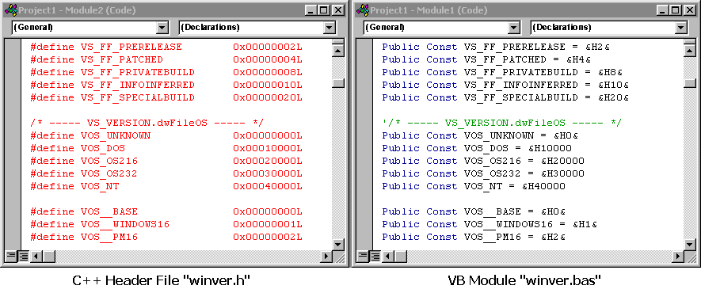



## C\+\+ Header File to VB Module Translator

### Description

It all started when I was trying to translate WINGDI.H. It took me three days to complete about 1/3 of the translation. I decided to write program which will do it automatically. First version of the program already in it's first run translated about 1/2 of the code in less than 30 seconds. I improved the translation algorythm and wrote this program completely from null. In the first run it translated at already about 2/3 of the header file in less than 10 seconds. I improved some more parts of the algorythm and here I am.

The core of this project is C_TO_VB.BAS module. You can add this module to your own projects or user interfaces.

Program currently is able to automatically exclude unsupported compilier flags; convert remarks, boolean operators, hexadecimal values, constant definitions, type definitions and remove casts.

Still under development enumeration conversion and API declaration conversion.

Module can not and will not be able to convert subs, functions and macros due to the complexity of the C++ language.

Also remember that the C_TO_VB.BAS module can not convert 100% of the source-code. Average efficiency is 80-90%. After using this tool you can convert the remaining code manually.

Future versions will be more intellegent and I hope they will be able to translate 95-99% of the code.

(!) I included some Microsoft "win*" C++ header files (*.H) for experimenting with this little module. If you have MS Visual C++ installed, you can find more header files in MICROSOFT VISUAL STUDIO\VC98\INCLUDE\ folder. If you haven't got C++ installed, you still can get these header files -- visit HTTP:\\MSDN.MICROSOFT.COM!
 
### More Info
 

             |
---                |---
**Submitted On**   |2003-06-15 11:40:18
**By**             |[Martins Skujenieks](https://github.com/Planet-Source-Code/PSCIndex/blob/master/ByAuthor/martins-skujenieks.md)
**Level**          |Advanced
**User Rating**    |4.9 (78 globes from 16 users)
**Compatibility**  |VB 6\.0
**Category**       |[Miscellaneous](https://github.com/Planet-Source-Code/PSCIndex/blob/master/ByCategory/miscellaneous__1-1.md)
**World**          |[Visual Basic](https://github.com/Planet-Source-Code/PSCIndex/blob/master/ByWorld/visual-basic.md)
**Archive File**   |[C\+\+\_Header1601056152003\.zip](https://github.com/Planet-Source-Code/martins-skujenieks-c-header-file-to-vb-module-translator__1-46187/archive/master.zip)

